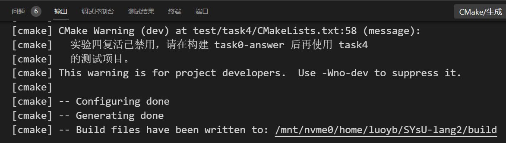
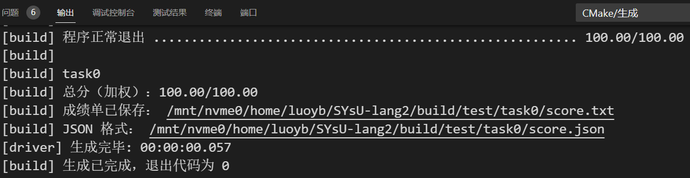
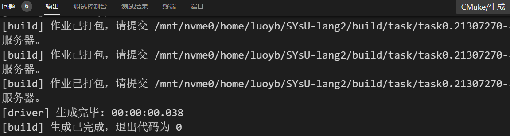

# 编译原理实验0
|姓名|罗以彬|学号|21307270|
|---|---|---|---|

## 环境配置
本实验在实验室服务器完成

### 可选方案 3 ⸺ 命令行手动配置（不使用 Docker）
#### 拉取实验代码仓库
- 将实验仓库fork到个人github上：https://github.com/ITcarrot/SYsU-lang2
- `git clone https://github.com/ITcarrot/SYsU-lang2.git`

#### 使用包管理器下载安装必备软件
- 服务器已有：ninja-build wget cmake xz-utils unzip g++ flex bison
- 安装剩余依赖：`spack install llvm@14`
  - [Spack](https://spack.io/)：A flexible package manager supporting multiple versions, configurations, platforms, and compilers.
- 设置环境自动加载：`echo "spack load llvm" >> ~/.bashrc`

#### 编译安装llvm、antlr，或直接使用llvm提供的二进制包
- `cd ~/SYsU-lang2/llvm/ && bash install.sh`

#### 配置vscode和cmake
- 根据指引安装插件即可

## Task0 实验内容
### 项目构建

### 1. 构建 task0

### 2. 构建 task0-score

### 3. 构建 task0-pack
