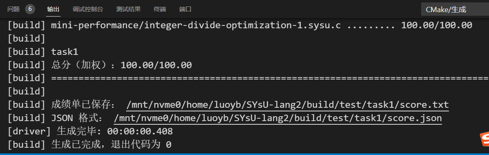

# 编译原理实验1
|姓名|罗以彬|学号|21307270|
|---|---|---|---|

## 实验要求
输出除eof和不可见字符外的所有词法单元在源文件的位置和源文件的路径。为了简化词法分析器，对于文件结束符eof，我们仅判断其是否被正确识别并输出别名，而不进行词法单元位置和源文件路径的判断。

## 实验过程
### 安装antlr
- `cd ~/SYsU-lang2/antlr && bash install.sh`
- 由于cmake下载器的TLS连接走隧道会出问题，选择先将cmake过程中所需的文件下载，再修改链接指向本地文件
```bash
wget https://github.com/google/googletest/archive/e2239ee6043f73722e7aa812a459f54a28552929.zip
mv e2239ee6043f73722e7aa812a459f54a28552929.zip googletest.zip
vi source/runtime/CMakeLists.txt # 修改第65行为：URL file:///mnt/nvme0/home/luoyb/SYsU-lang2/antlr/googletest.zip
cmake source -B build -G Ninja -DCMAKE_INSTALL_PREFIX=$(realpath install) -DANTLR4_INSTALL=ON
cmake --build build --target install
```

### 位置识别
clang预处理器在文件中用#开头的导语注释了后续代码所在文件的文件名和起始行号

在函数内使用static变量维护当前所在文件和行偏移量即可

### 空格和换行识别
在函数内使用static保存空格和换行标记，遇到空格换行设为true，在下一个token消耗这个标记（输出信息并设为false）

### 添加关键字
Antlr要求token名称首字母大写，而clang词法分析器得到的token名都是小写，因此默认把得到的token名转换为小写输出。在SYsU_lang.g4添加以下条目即可：
- Const : 'const'
- Void : 'void'
- If : 'if'
- Else : 'else'
- While : 'while'
- Break : 'break'
- Continue : 'continue'
- 16进制数：在IntegerConstant添加HexadecimalConstant：'0x'HexadecimalDigit*，HexadecimalDigit为[0-9a-fA-F]
- Minus : '-'
- Star : '*'
- Slash : '/'
- Percent : '%'
- Equalequal : '=='
- Greater : '>'
- Greaterequal : '>='
- Less : '<'
- Lessequal : '<='
- Exclaim : '!'
- Exclaimequal : '!='
- Pipepipe : '||'
- Ampamp : '&&'

## 实验结果
