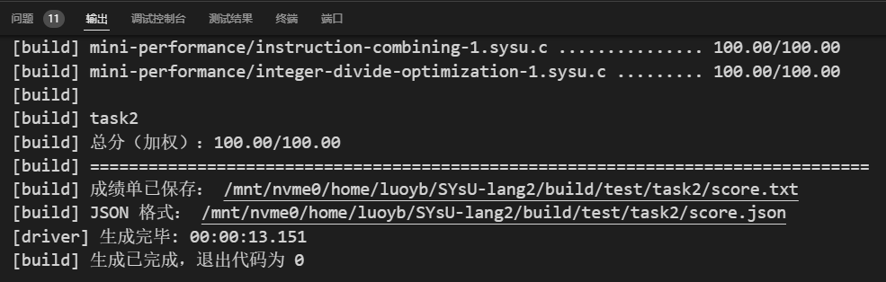

# 编译原理实验2
|姓名|罗以彬|学号|21307270|
|---|---|---|---|

## 实验要求
在本次实验中，我们首先需要完成一个语法分析器。实验一中我们实现了一个词法分析器，源代码文件输入词法分析器后将会生成 token 流，token 流输入到语法分析器之后会生成语法分析树 AST。AST 主要反映了程序的结构，但不足以全面表示程序的语义信息。语法分析图 ASG 在 AST 的基础上增加了额外的语义信息，如作用域、类型信息、变量和函数之间的关系等，这有助于进一步的编译优化、类型检查和代码生成等步骤。但是在本次实验中不管是 AST 还是 ASG，都是位于内存中的数据结构，不便于同学们进行打印输出或者代码调试以及实验评分，所以最终我们还需要实现 ASG 数据结构到 JSON 格式输出的实现。

### 评分标准
同学们查看json文件，会发现上述每个节点里面包含了非常多的属性，除去TypedefDecl不用管之外，我们的评分以属性打印为准，具体如下：

- 是否提取出正确的 "kind"、"name"、"value" 键值，不含 "InitListExpr"（60 分）
- 是否提取出正确的 "type" 键值及是否构造正确的 "InitListExpr" 生成树（40 分）

## 实验过程
### 添加关键字
在`SYsULexer.cpp`和`SYsULexer.tokens`中添加语法关键字，事实上将task1中要识别的关键字复制过来即可。

### 处理Const变量
给`SYsUParser.g4`的`typeSpecifier`添加一个可选关键字`Const`，在`Ast2Asg.cpp`的`Ast2Asg::operator()(ast::DeclarationSpecifiersContext* ctx)`里识别关键字`Const`并将结果保存在返回值的`Type::Qual`的`const_`属性里

### 处理乘除模
- `SYsUParser.g4`：在`additiveExpression`到`unaryExpression`之间串入一个`multiplicativeExpression`来识别乘除模
- `Ast2Asg.cpp`：同样地串入一个处理乘除模的函数，实现方式和加减法的实现一致，修改符号转换部分即可

### 处理二元逻辑运算表达式
仿照处理乘除模的方法，按优先级从高到低依次叠加到`additiveExpression`上，顺序如下：
- unaryExpression
- multiplicativeExpression
- additiveExpression
- compareExpression
- equalExpression
- ampampExpression
- pipepipeExpression

### 处理括号表达式
- 创建一个`ParenExpression`
  - `SYsUParser.g4`：创建规则
  - `Ast2Asg.cpp`：调用`Expression`，再给得到的节点套多一层`ParenExpr`类型的节点
- 建立`primaryExpression`到`ParenExpression`的调用
  - `SYsUParser.g4`：设置`primaryExpression`可以是`ParenExpression`
  - `Ast2Asg.cpp`：建立一条从`primaryExpression`到`ParenExpression`的调用

### 处理数组访问
- 修改`postfixExpression`以识别数组
  - `SYsUParser.g4`：用递归方式允许`primaryExpression`后附加任意数量的`[expression]`
  - `Ast2Asg.cpp`：在`postfixExpression`的识别处将数组访问识别为一种二元运算

### 处理带参函数
- 创建`functionParms`和`parmVarDeclaration`，前者表示有0或多个函数参数（后者）
  - `SYsUParser.g4`：创建规则
  - `Ast2Asg.cpp`：`parmVarDeclaration`参考`initDeclarator`的实现，`functionParms`将参数打包成vector
- 建立`functionDefinition`到`functionParms`的调用
  - `SYsUParser.g4`：用`functionParms`替换左右括号的识别
  - `Ast2Asg.cpp`：将`functionParms`的结果保存

### 处理函数声明
将`functionParms`接入`initDeclarator`使得可以声明函数
- `SYsUParser.g4`：将`functionParms`作为`initDeclarator`的可选参数
- `Ast2Asg.cpp`：`initDeclarator`本来就有处理函数声明的部分实现，补全并适配`functionParms`即可

### 处理函数调用
- 创建一个`callExpression`
  - `SYsUParser.g4`：创建规则，由指示符和若干赋值语句组成
  - `Ast2Asg.cpp`：创建`callExpr`类型的节点，收集函数索引和调用参数表达式
- 建立`primaryExpression`到`callExpression`的调用
  - `SYsUParser.g4`：设置`primaryExpression`可以是`callExpression`
  - `Ast2Asg.cpp`：建立一条从`primaryExpression`到`callExpression`的调用

### 处理If
- 创建一个`ifStatement`
  - `SYsUParser.g4`：创建规则，If表达式及后续执行代码是必须的，else是可选的
  - `Ast2Asg.cpp`：创建`IfStmt`类型的节点，收集条件表达式及后续执行代码块
- 建立`statement`到`ifStatement`的调用
  - `SYsUParser.g4`：设置`statement`可以是`ifStatement`
  - `Ast2Asg.cpp`：建立一条从`statement`到`ifStatement`的调用

### 处理While
和If类似，不再赘述

### 处理break和continue
- `SYsUParser.g4`：将关键字添加到`jumpStatement`的列表中
- `Ast2Asg.cpp`：在`JumpStatement`匹配关键字，返回`BreakStmt`和`ContinueStmt`类型的节点

## 实验结果
