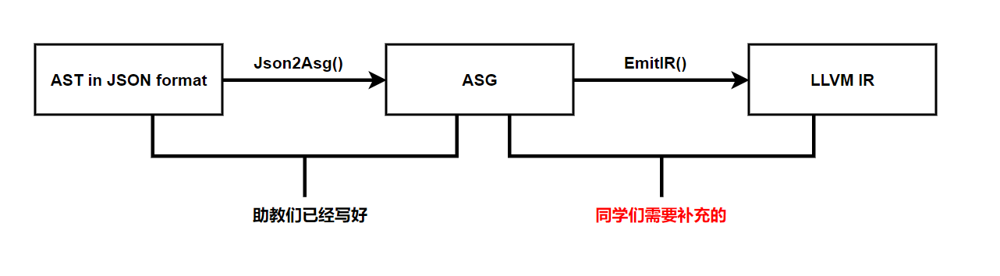
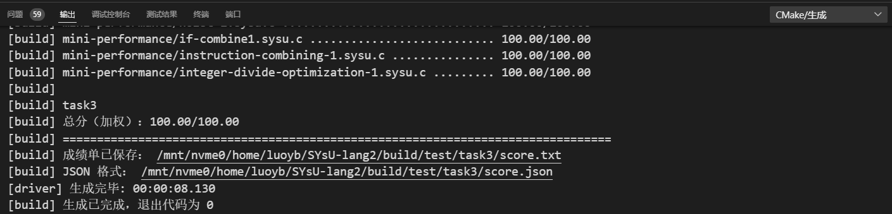

# 编译原理实验3
|姓名|罗以彬|学号|21307270|
|---|---|---|---|

## 实验要求
在本次实验中，大家将要完成一个中间代码生成器，程序的输入是实验二的答案，也就是 JSON 格式的抽象语法树，程序的输出是 LLVM IR（本次实验中为可读的汇编文本格式，文件后缀为 .ll）。同学们在进行实验的过程中，可以参考 task3-answer 输出的答案。从实验三开始，大家将逐渐体会到 LLVM 库的强大。

助教提供的实验三中间代码生成器框架的工作流程如下所示：



task3的目录结构如下：
```
-- task3
    |- Obj.hpp
    |- Obj.cpp
    |- asg.hpp
    |- asg.cpp
    |- Json2Asg.hpp
    |- Json2Asg.cpp
    |- EmitIR.hpp
    |- EmitIR.cpp
    `- main.cpp
```
相信大家对 Obj.hpp/cpp 和 asg.hpp/cpp 四个文件已经很熟悉了，它们帮助了大家顺利地完成了实验二，本次实验就不再对它们进行介绍了。

Json2Asg.hpp/cpp 实现了 Json2Asg 类，它的功能是读取 llvm::json::Value 格式的抽象语法树，并将其转换为抽象语义图，输出 asg::TranslationUnit。助教们已经实现了这个类，大家不需要对其进行过多的关注。

EmitIR.hpp/cpp 用于实现 EmitIR 类，它的功能是读取抽象语义图，即 Json2Asg 输出的 asg::TranslationUnit，然后根据其来生成 LLVM IR。助教们已经已经实现了这个类的基本功能，使目前的实验三代码仅仅能够通过 functional-0/000_main.sysu.c 这个测例。同学们在实验三中需要做的，就是完善这个类，使得最终实验三的代码能够通过所有测例。

main.cpp 是实验三中间代码生成器的程序入口，负责创建 Json2Asg 实例读取 JSON 格式的抽象语法树，输出 asg::TranslationUnit 传给 EmitIR 实例生成 LLVM IR，输出到文件中。main.cpp 的代码也不需要同学们关注。

总而言之，同学们在实验三中需要做的，就是完善 EmitIR 类，即补充 EmitIR.hpp 和 EmitIR.cpp 两个文件中的代码，使得实验三的代码最终能够顺利通过所有测例，成为一个完成的中间代码生成器。

### 评分标准
LLVM IR 是可以通过 LLVM 的工具 lli 被直接执行的，如 lli output.ll。

实验三的评分只考虑同学们生成的 LLVM IR 的正确性，对于一个编译器而言，程序的正确性是必然的。对于每个测例，同学们生成的 LLVM IR 不必与标准答案（clang 输出的 LLVM IR，即 task3-answer）相同，只要你生成的 LLVM IR 被执行后，程序的返回值和输出与 clang 生成的 LLVM IR 被执行后的返回值和输出相同，就算通过了该测例。

当所有测例都通过后，那么恭喜同学们拿到了满分！

## 实验过程
### 处理变量声明
- 变量声明`VarDecl`时，全局变量和局部变量分别处理
- 在全局保存当前函数开始时的栈位置，根据有无栈位置区分全局变量和局部变量
- 使用`llvm::GlobalVariable`创建全局变量，使用构造函数初始化全局变量
- 使用llvm提供的栈快照指令限制局部变量的存活时间，代码块结束时栈回退栈标记，return时回退至当前函数开始时的栈位置
- 使用`CreateAlloca`创建局部变量，随后直接计算并设置初值
- 使用递归方法构造数组类型
- 使用递归方法处理初始化列表并依次用store赋值
- 使用memset处理隐式数组初始化

### 处理表达式
- 引用表达式：取出引用变量的指针作为左值
- 二元表达式
  - 数组索引时，先提取元素的类型，再使用GEP完成操作
  - 使用if else方法实现逻辑与、逻辑或的计算和短接，使用phi变量获取逻辑判断的结果
  - 使用对应的llvm接口实现剩余各种操作
- 一元表达式：
  - 使用对应的llvm接口实现取负
  - 使用cmpeq 0 实现逻辑非
- 括号表达式：返回括号内容的生成结果即可

### 实现隐式类型转换
- 使用load指令实现左值转右值
- 在数组转指针时，复制数组类型作为指针类型
- 在函数转指针时，什么都不做

### 处理函数声明与调用
- 遍历参数类型用于声明函数
- 由于ir中函数参数为右值，函数实现时要遍历参数列表，为每个参数创建局部变量并赋值，并保存到asg节点上
- 调用函数时，使用llvm的接口即可

### 处理条件分支
- 添加bool_cast将所有条件表达式的结果转换为bool
- 创建then、else、end三个块实现if
- 创建cond、body、end三个块实现while
- 使用全局变量维护当前循环的开始和结束块指针给continue和break使用

## 实验结果
